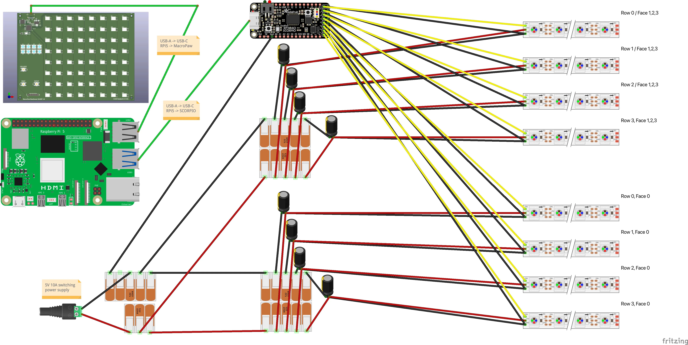
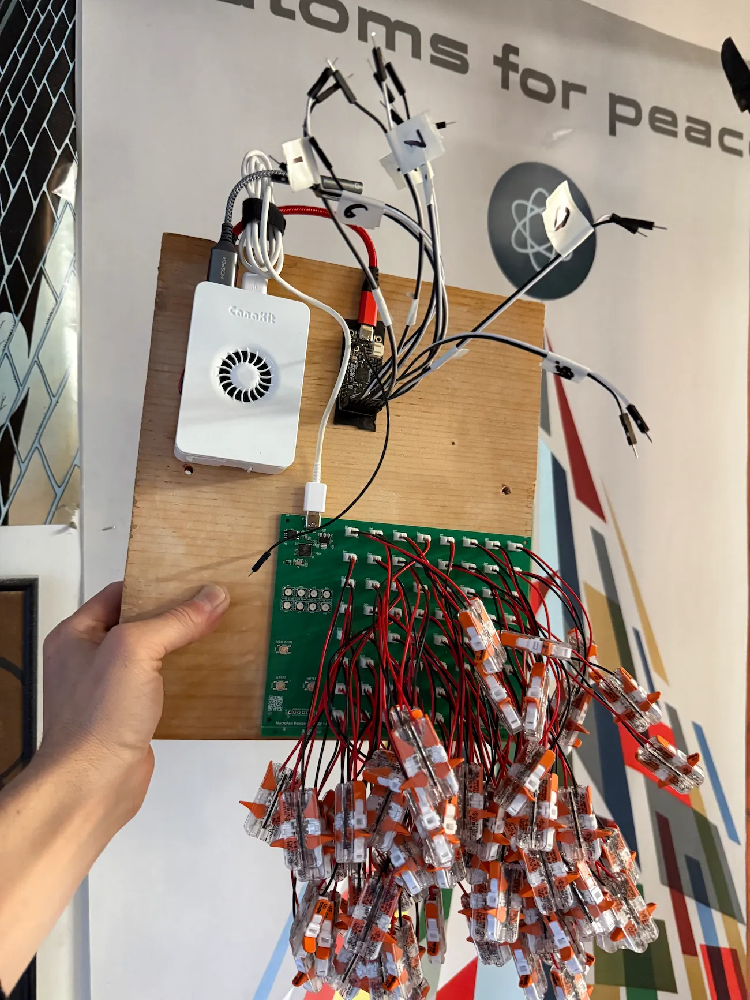
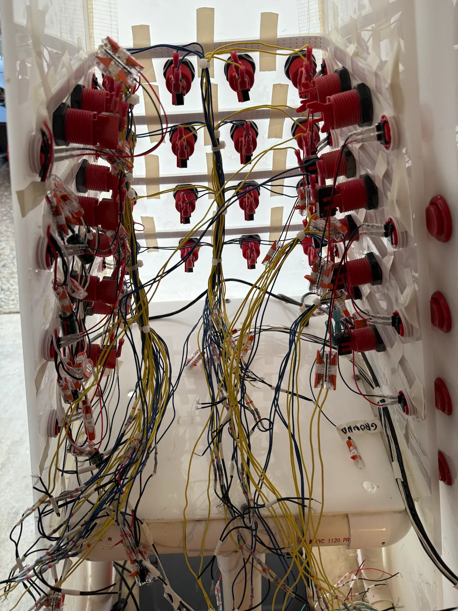
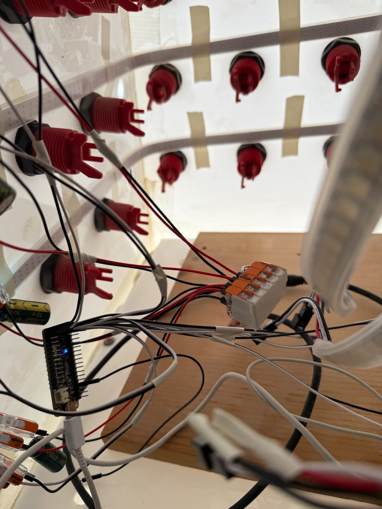
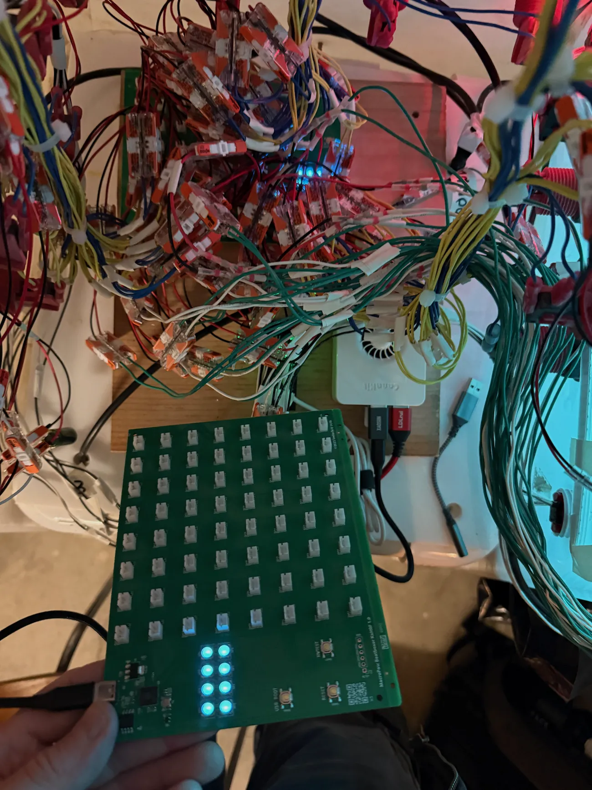
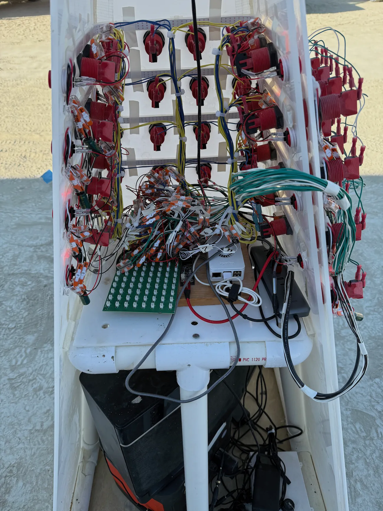
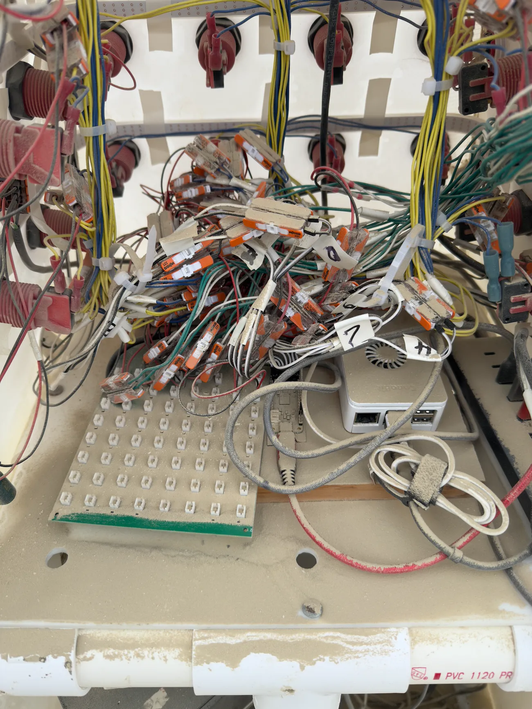

# Beatboxer: A human-sized drum machine built with a Raspberry Pi, a Feather SCORPIO, NeoPixels, and Go

<iframe width="560" height="315" src="https://www.youtube.com/embed/MepepCV4EUw" frameborder="0" allowfullscreen></iframe>

# Prior Art

Inspired by Nine Inch Nails' Echoplex drum machine:

<iframe width="560" height="315" src="https://www.youtube.com/embed/6O_92BTrUcA" frameborder="0" allowfullscreen></iframe>
---
First implementation in JavaScript at [sig.gy/beatboxer](https://sig.gy/beatboxer):

<iframe width="900" height="315" src="https://sig.gy/beatboxer" frameborder="0" allowfullscreen></iframe>

# Hardware

- [Raspberry Pi 5](https://www.raspberrypi.com/products/raspberry-pi-5/)
- [Adafruit Feather RP2040 SCORPIO](https://www.adafruit.com/product/5650)
- 8x [Neopixel 144 strands](https://www.adafruit.com/product/2847)
- [Custom MacroPaw keyboard](https://github.com/kodachi614/macropaw) by [@kodachi614](https://github.com/kodachi614)

<a href="assets/images/bbox2025_fritzing.fzz">Click here</a> to download the source Fritzing sketch file (requires the <a href="https://github.com/adafruit/Fritzing-Library">Adafruit Fritzing Library</a> and a <a href="https://github.com/siggy/macropaw/blob/main/Beatboxer/renders/macropaw_beatboxer_small.fzpz">custom MacroPaw part</a>).

# Software

- [main.go](https://github.com/siggy/bbox/blob/main/cmd/bbox/main.go)
- [generic program interface](https://github.com/siggy/bbox/blob/main/pkg/program/program.go#L16-L32)
- [SCORPIO integration](https://github.com/siggy/bbox/tree/main/scorpio)

# Build photos

## Contact

<a href="https://github.com/siggy/bbox/issues">File an issue against this repo</a>, or find me at <a href="https://sig.gy">sig.gy</a>

This doc updated for 2025. For the original 2017-2018 writeup, see [Beatboxer 2017-2018](2017-2018).

