# Beatboxer: A human-sized drum machine built with a Raspberry Pi, LEDs, and Go

This is the story of building Beatboxer:

## 2017

<iframe width="560" height="315" src="https://www.youtube.com/embed/2gNIAz0s2dg" frameborder="0" allowfullscreen></iframe>

## 2018

<iframe width="560" height="315" src="https://www.youtube.com/embed/dJoFQYvSYmA" frameborder="0" allowfullscreen></iframe>

## Prior Art

### Nine Inch Nails

Around 2008 I saw Nine Inch Nails perform Echoplex using a drum machine that occupied the entire stage:

<iframe width="560" height="315" src="https://www.youtube.com/embed/6O_92BTrUcA" frameborder="0" allowfullscreen></iframe>

I loved it, I wanted to build something like it.

### Raspberry Pi

Eight years later in 2016 I had a converstion with my friend [Nick](https://github.com/hebnern) about his Arduino integration into [The Krawler](https://www.facebook.com/thekrawler/)'s fire poofers, he mentioned the lack of library and developer support being a pain point. He said he'd use a Raspberry Pi the next time, since it's pretty much just a Linux computer. This caught my attention. _It's a UNIX system, I know this._ That was the catalyst to look for an excuse to play with a Pi.

<a href="assets/images/raspberry_pi_boot.jpg" data-lightbox="raspberry_pi" data-title="Raspberry Pi Boot">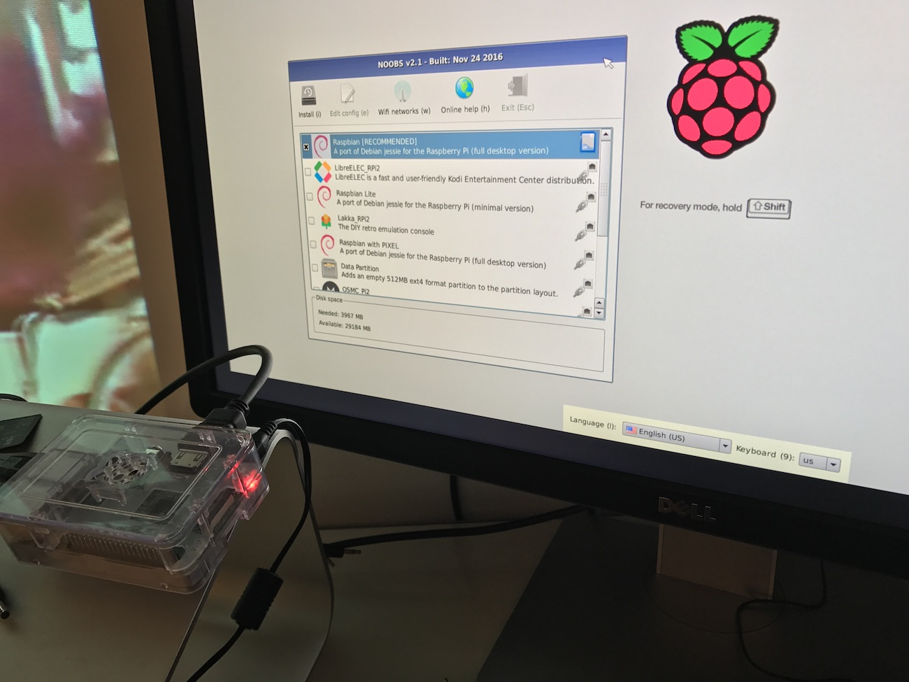</a><a href="assets/images/raspberry_pi_pinout.jpg" data-lightbox="raspberry_pi" data-title="Raspberry Pi Pinout">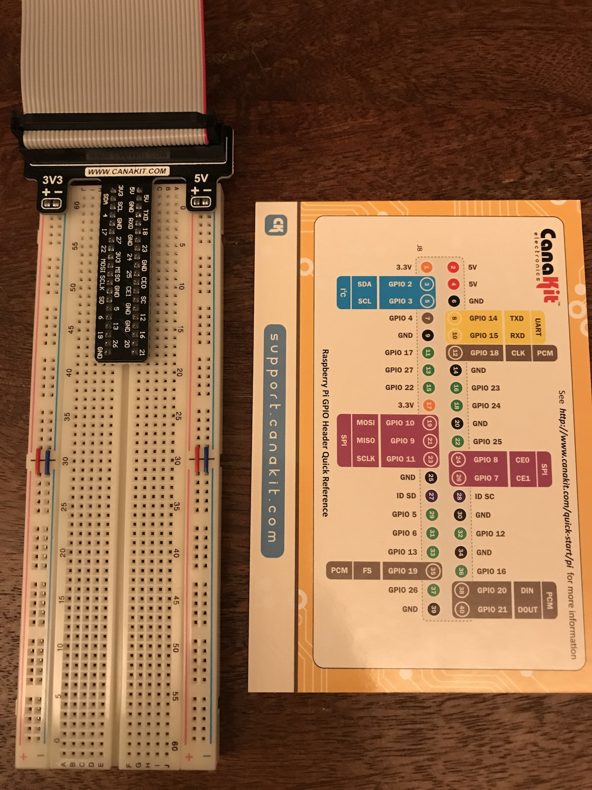</a>

### Beatboxer in JavaScript

<a href="https://github.com/siggy/beatboxer/commit/17850ff889e607aba5941c5de58ecba9b342d5c0">About a week</a> after chatting with Nick, I attempted to replicate Nine Inch Nails' drum machine on a web page, using as little code as possible. The result was a few hundred lines of JavaScript, HTML, and CSS, I called it [Beatboxer](https://sig.gy/beatboxer/):

<iframe width="900" height="315" src="https://sig.gy/beatboxer/" frameborder="0" allowfullscreen></iframe>

This was a fun project, I learned a bit about [AudioContext](https://developer.mozilla.org/en-US/docs/Web/API/AudioContext) for playing sounds and [requestAnimationFrame](https://developer.mozilla.org/en-US/docs/Web/API/window/requestAnimationFrame) for timing.

## A rewrite in Go

[Go](https://golang.org/) has recently become a favorite programming language of mine. Rewriting Beatboxer in Go was a great excuse to play with the language a bit more.

Beatboxer transmits input from a keyboard to LEDs, a console renderer, and a drum loop. The Go language really shines here in allowing explicit definition of these concurrent threads, with communication via Go Channels. This whole architecture is summarized nicely in [Beatboxer's main](https://github.com/siggy/bbox/blob/master/cmd/bbox.go).

Reading and playing back audio files in Go turned out to be more work than in JavaScript. I eventually found a pair of excellent Go libraries, [youpy's go-wav](https://github.com/youpy/go-wav) for reading wavs, and [gordonklaus' Go bindings](https://github.com/gordonklaus/portaudio) for [PortAudio](http://portaudio.com/) for outputting sound.

I found an awesome collection of high quality drum samples at [99sounds.org](http://99sounds.org/drum-samples/). It's free for download. Throw them a donation if you appreciate their work. I found their 808 beats to be just want I needed. I reached out to confirm they were OK with me using their samples in a public art project, [Tomislav](https://twitter.com/bpblog) replied a few hours later with full support.

## Back to hardware

With a working prototype in Go, I returned to thinking about building a physical drum machine. [Burning Man 2017](https://burningman.org/) provided a concrete deadline for added motivation.

I began brainstorming a structure with my good friend [@yet](https://twitter.com/yet), who pointed out that a long, flat structure like the one used by Nine Inch Nails would not fare well in the gale-force winds of the Black Rock Desert. He suggested wrapping the drum machine into the shape of a phone booth, as a more compact structure would be much easier to build, transport, and support.

A few days later I described the project to my good friend [Jhon](http://www.jar-lab.com/). Jhon's background in electronics and industrial design exceeds just about anyone I know, and he immediately suggested I reshape the phone booth as a pyramid. I loved the idea. At the time I did not realize the added complexity a shape like this would require, but in the end it was worth it.

<a href="assets/images/sketch1.jpg" data-lightbox="sketch" data-title="Sketch1">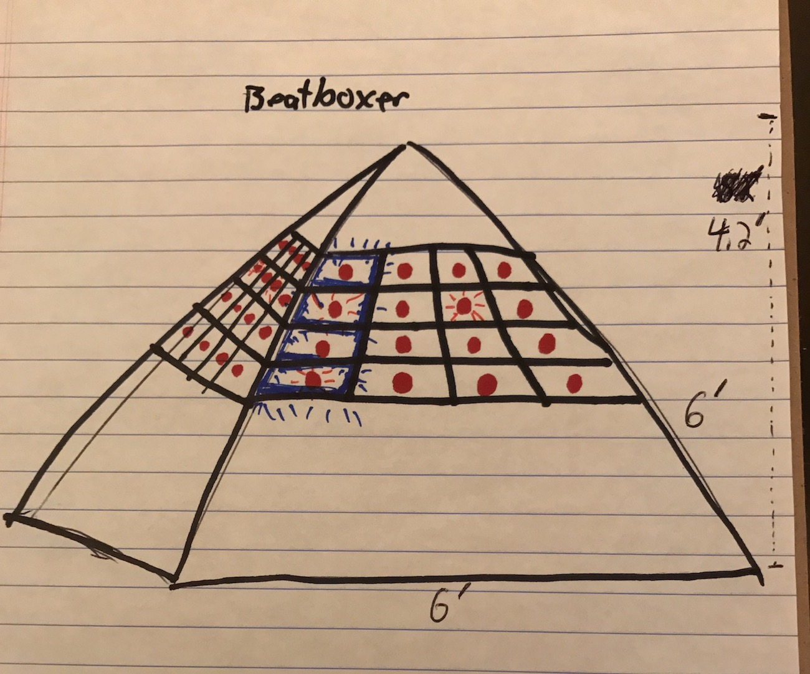</a><a href="assets/images/sketch2.jpg" data-lightbox="sketch" data-title="Sketch2">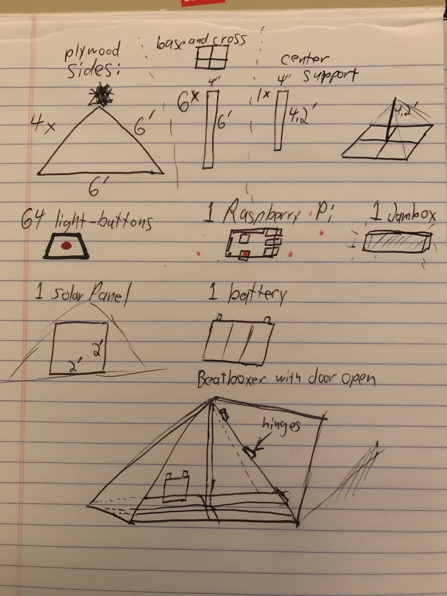</a><a href="assets/images/sketch3.jpg" data-lightbox="sketch" data-title="Sketch3">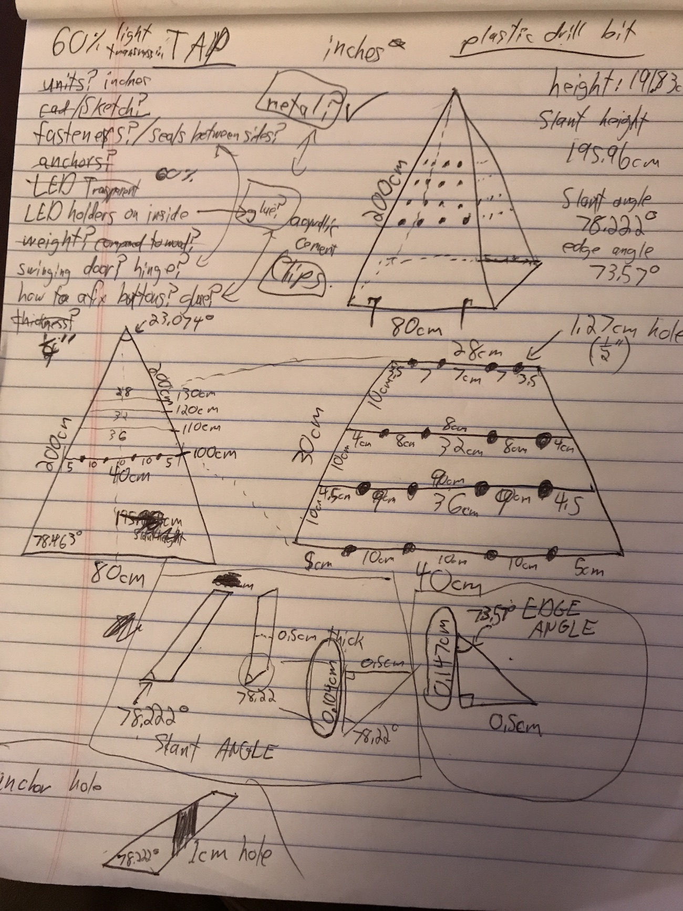</a>

To build a pyramid, I naively thought I could simply design four triangles, do some linear calculations for the angles, and all would fit together. Fortunately my good friend and owner of Three Bears Furniture, [@jneaderhouser](https://twitter.com/jneaderhouser), pointed me to this excellent [compound miter calculator](http://www.pdxtex.com/canoe/compound.htm). This helped me determine that, based on triangles 6 feet tall by 2.5 feet wide, I needed 46.244° side bevels and 77.975° base bevels. I was able to confirm this all worked by building Beatboxer in SketchUp:

<a href="assets/images/sketchup2.jpg" data-lightbox="sketchup" data-title="SketchUp">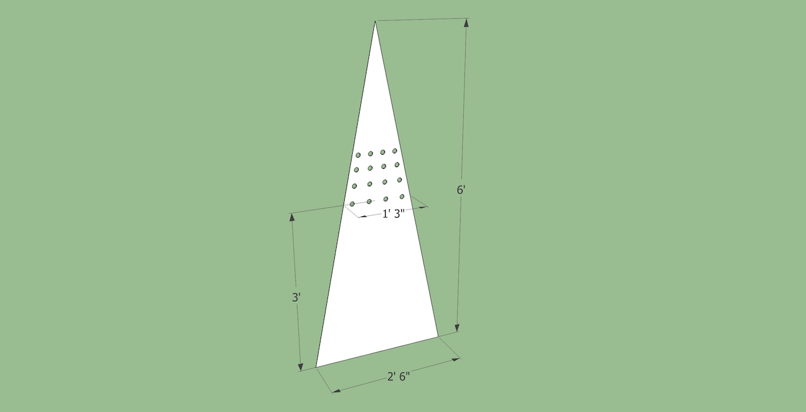</a><a href="assets/images/sketchup3.jpg" data-lightbox="sketchup" data-title="SketchUp">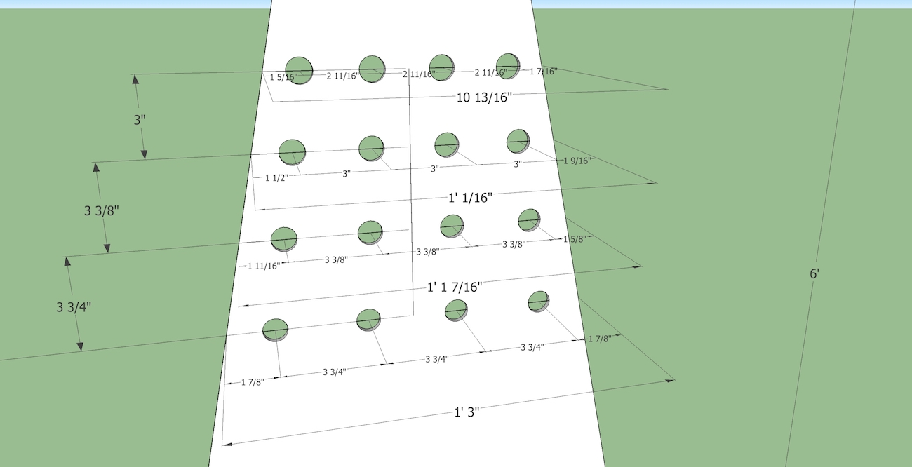</a>

For the full <a href="https://www.sketchup.com/">SketchUp</a> file, <a href="assets/images/bbox_sketchup.skp">click here</a>.

### Addressable LEDs

As the physical form continued to coalesce, I knew I'd need buttons to enable beats, and LEDs to provide feedback. I began researching addressable LEDs. Like Go, this was another domain where I was looking for a personal project to enable learning more about. Arduino seemed to be the platform of choice for working with LEDs. I opted to build the project around a Pi, aware that I was going a bit against the grain.

Fortunately the amazing folks at [Adafruit](https://www.adafruit.com/) had a tutorial on [controlling NeoPixel LEDs with a Raspberry Pi](https://learn.adafruit.com/neopixels-on-raspberry-pi). Even more fortuitious, the library used in the tutorial, [jgarff's rpi_ws281x](https://github.com/jgarff/rpi_ws281x), came with a Go wrapper!

I cannot emphasize enough how helpful [Adafruit](https://www.adafruit.com/) is for projects such as these. Their tutorials and documentation are awesome, and they provide all the materials needed to follow along.

Controlling [NeoPixels](https://www.adafruit.com/category/168) from a Pi requires building a circuit board, something I had zero experience with. I again enlisted [@yet](https://twitter.com/yet)'s help to learn how to solder wires, chips, and resistors. In short order we had a Pi controlling [NeoPixels](https://www.adafruit.com/category/168).

<a href="assets/images/neopixels1.jpg" data-lightbox="neopixels" data-title="NeoPixels">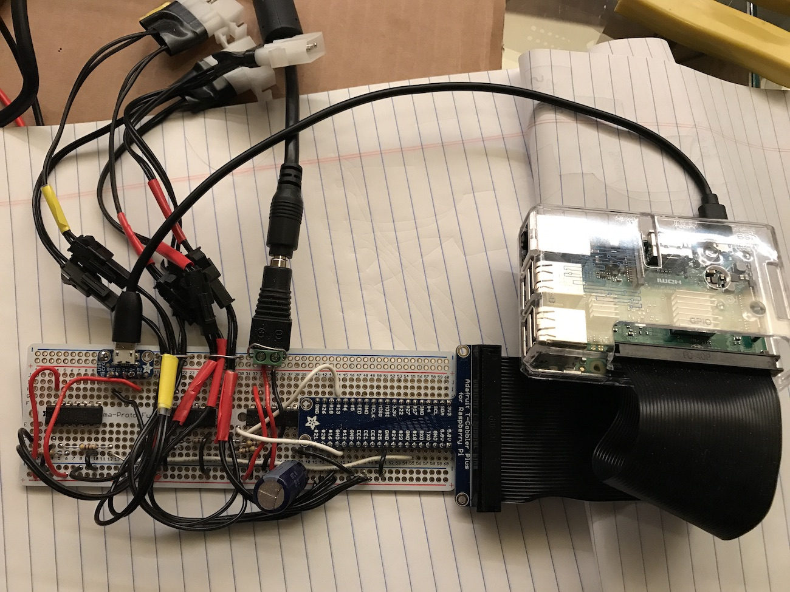</a><a href="assets/images/neopixels2.jpg" data-lightbox="neopixels" data-title="NeoPixels">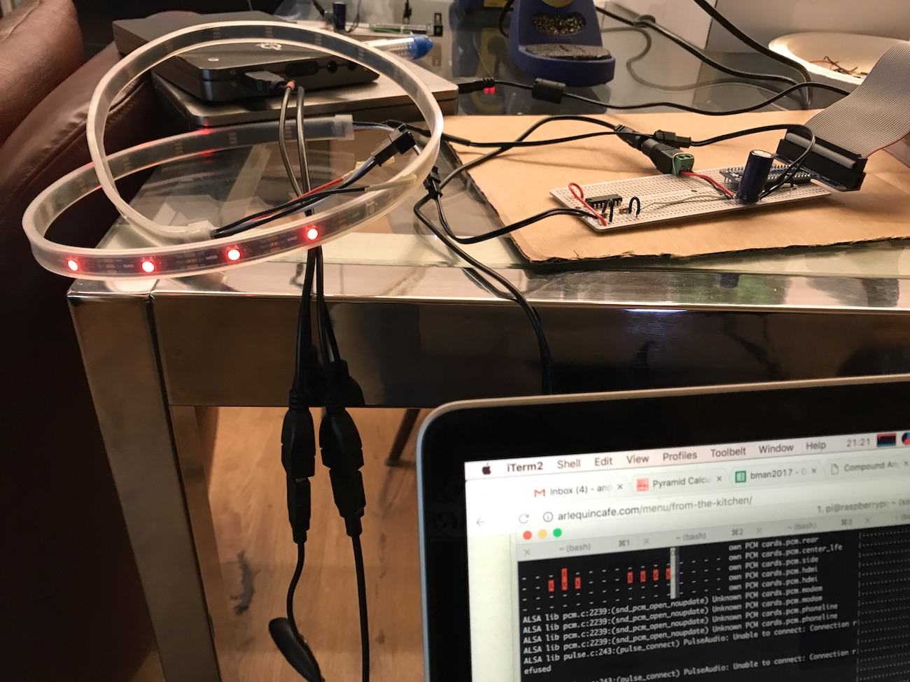</a><a href="assets/images/neopixels3.jpg" data-lightbox="neopixels" data-title="NeoPixels">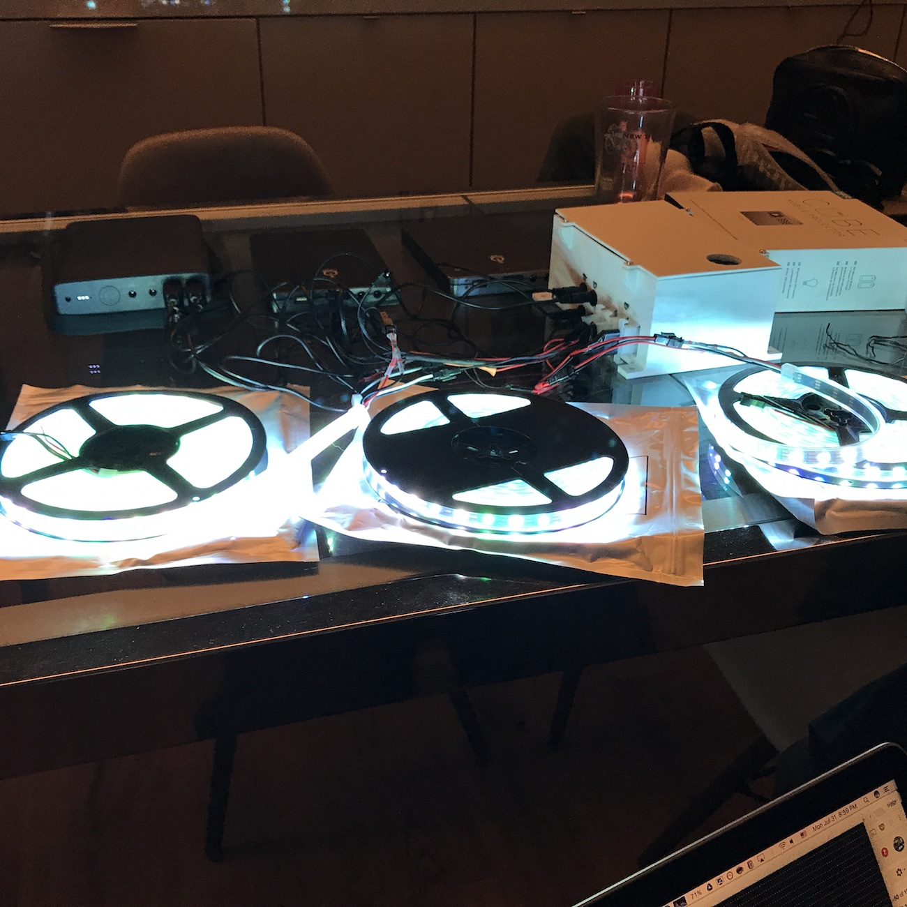</a>

### Pulse width modulation and onboard audio

The [rpi_ws281x LED library](https://github.com/jgarff/rpi_ws281x) uses hardware PWM on the Raspbery Pi to communicate with the LEDs. Unfortunately this [conflicts](https://github.com/jgarff/rpi_ws281x#pwm) with the Pi's onboard sound card. To get around this, I disabled the onboard sound and installed a [Plugable USB Audio Adapter](https://www.amazon.com/gp/product/B00NMXY2MO). For more details on the config changes, have a look at the `external sound card` section of [this repo's README.md](https://github.com/siggy/bbox#env--bootup).

### Keyboard hacking

For user input, I wanted to use 64 large buttons to toggle beats. The Pi does not have enough pins to handle this many without other chips or boards. I had read about hacking apart a computer keyboard and wiring buttons into it, via [Instructables](https://www.instructables.com/) in two articles: [Hacking a USB Keyboard](https://www.instructables.com/id/Hacking-a-USB-Keyboard/) and [Create External Buttons For Your Keyboard](https://www.instructables.com/id/Create-External-Buttons-For-Your-Keyboard/). This was a compelling option, as the software was already built to accept keyboard inputs, no additional coding or GPIO programming required. It's a fun hack, though wiring 64 buttons into a tiny keyboard PCB yields this tangle of epicness:

<a href="assets/images/wires1.jpg" data-lightbox="wires" data-title="Wires">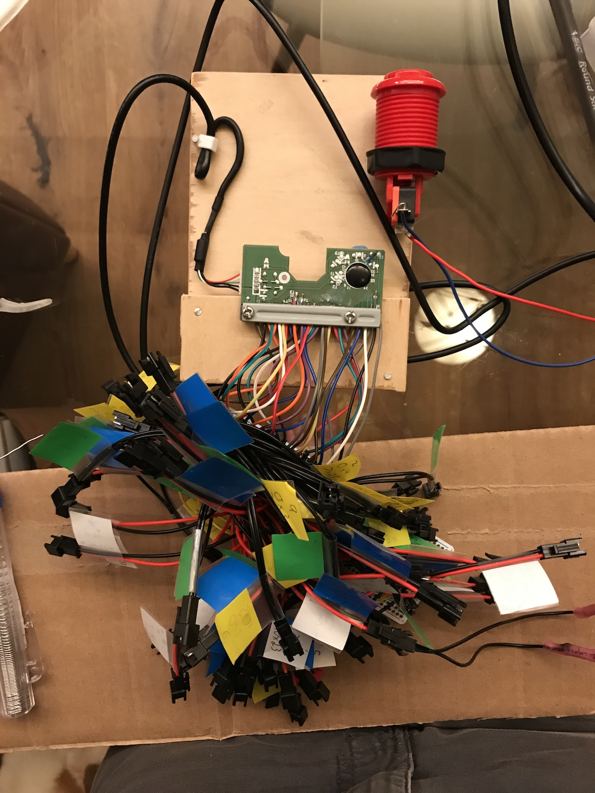</a><a href="assets/images/wires2.jpg" data-lightbox="wires" data-title="Wires">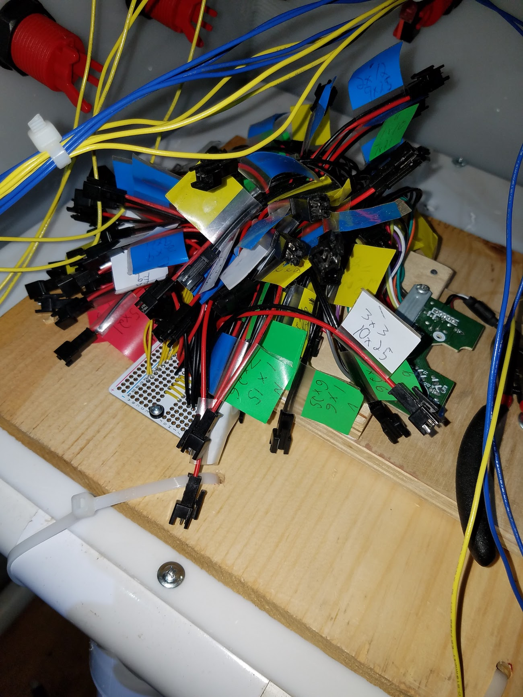</a><a href="assets/images/wires3.jpg" data-lightbox="wires" data-title="Wires">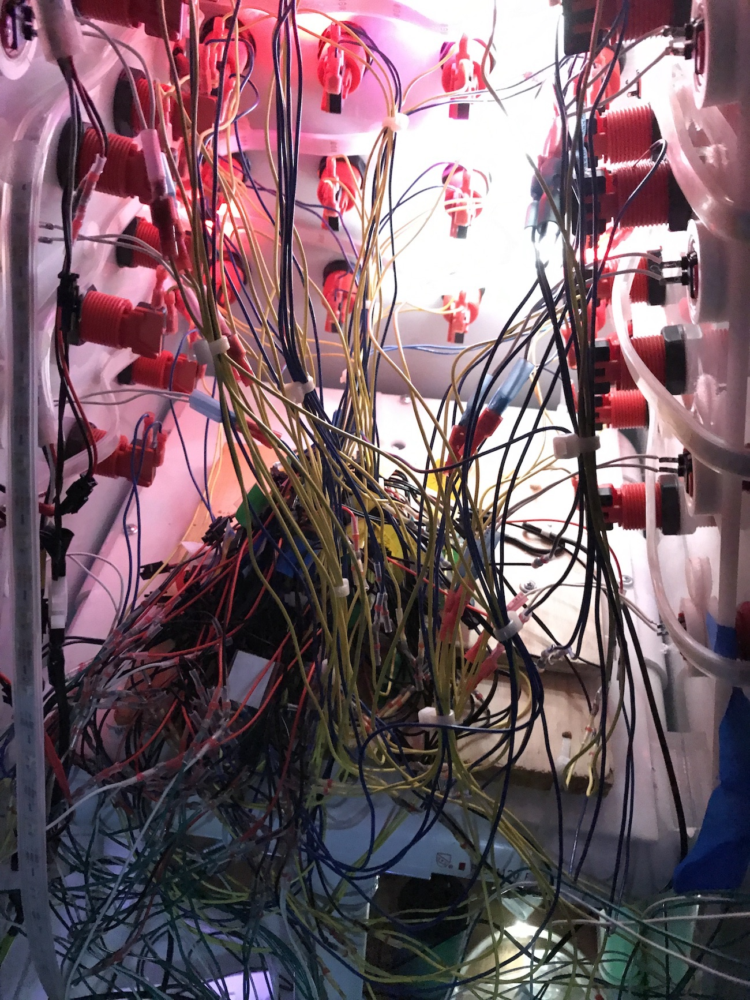</a>

Determined to hack this keyboard, I again enlisted much soldering help from [@yet](https://twitter.com/yet) to wire 30 pins from the keyboard pcb to an [Adafruit perma-proto board](https://www.adafruit.com/product/1606). From there we wired up 64 combinations of the 30 pins. For those interested in the pinouts of an [AmazonBasics Keyboard](https://www.amazon.com/gp/product/B005EOWBHC/ref=oh_aui_search_detailpage?ie=UTF8&psc=1), have a look at this [code](https://github.com/siggy/bbox/blob/master/bbox/keys.go).

### Plastics

In deciding on the material for the exterior of the pyramid, my friends [@yet](https://twitter.com/yet) and Brian MF Horton suggested plywood, but a desire for transparent material, to allow LEDs to shine through from the inside, led me to plastic. In the end we built the base and a halo out of plywood, as an homage to this initial design, and our shared fondness for [Tom Sachs' Love Letter to Plywood](https://vimeo.com/44947985).

I had no experience working with or manufacturing plastic. Fortunately, the good folks at [TAP Plastics SF](https://www.tapplastics.com/about/locations/detail/san_francisco_ca), and specifically my new friend at TAP, Jacobo, were extremely helpful in guiding me. I submitted the overall triangle dimensions for C&C manufacturing. The trickier part was producing those precise bevel angles so the triangles would fit together perfectly, and align with the ground. Jacobo took it upon himself to cut the bevels by hand. I had ordered up five triangles instead of four in case anything broke. I ended up with five perfectly shaped triangles. When put together, the four tops of the triangles fit with absolute precision, I cannot thank Jacobo and TAP enough for their work on this.

<a href="assets/images/jacobo.jpg" data-lightbox="jacobo" data-title="Jacobo from TAP Plastics">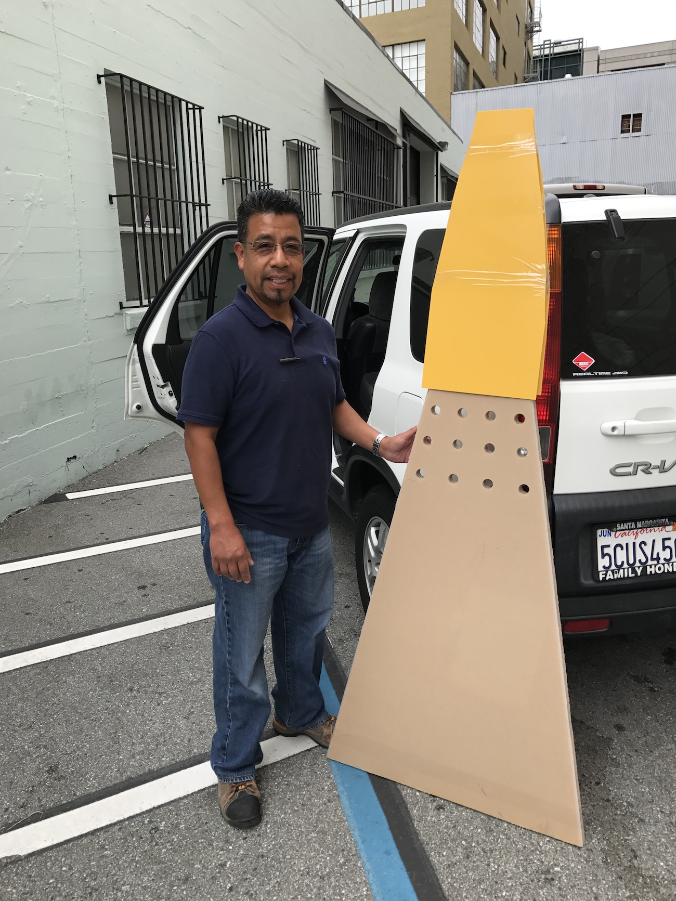</a><a href="assets/images/triangles_free_stand1.jpg" data-lightbox="jacobo" data-title="Free-standing triangles">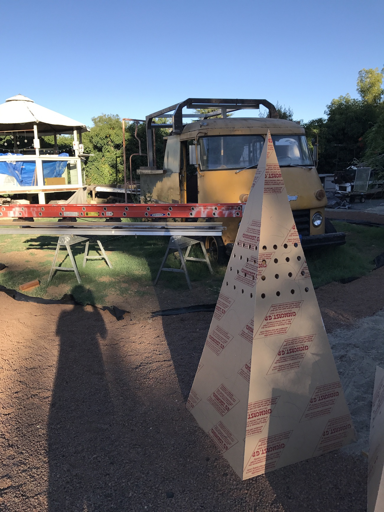</a><a href="assets/images/triangles_free_stand2.jpg" data-lightbox="jacobo" data-title="Free-standing triangles">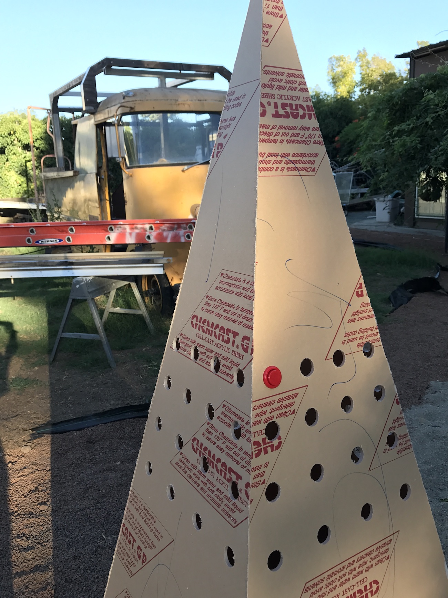</a>

### Construction

With software, electronics, and materials proven out, last was actual assembly. As with all the collaboration on this project, I simultaneously realized I needed help and found a friend extremely willing to jump in. My friend Brian, who could build a house if he had to, and had experience constructing things to withstand the elements at Burning Man, understood well before I did what was required to assemble Beatboxer. I showed up at his house expecting to ask some questions, and he had a complete internal skeleton designed, with materials sourced and ready to assemble. In one evening we went from plastic pieces to a sturdy pyramid. Brian built a complete internal structure out of PVC pipes, very strong and lightweight.

<a href="assets/images/triangles_pancakes.jpg" data-lightbox="structure" data-title="Triangles and Pancakes">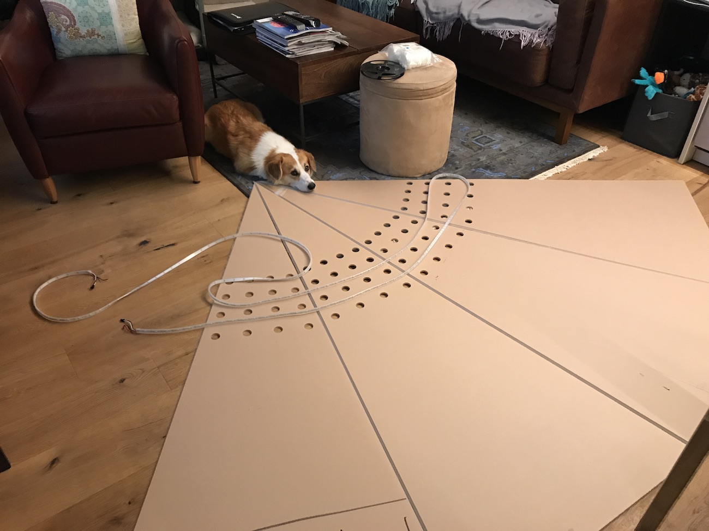</a><a href="assets/images/structure1.jpg" data-lightbox="structure" data-title="PVC Structure">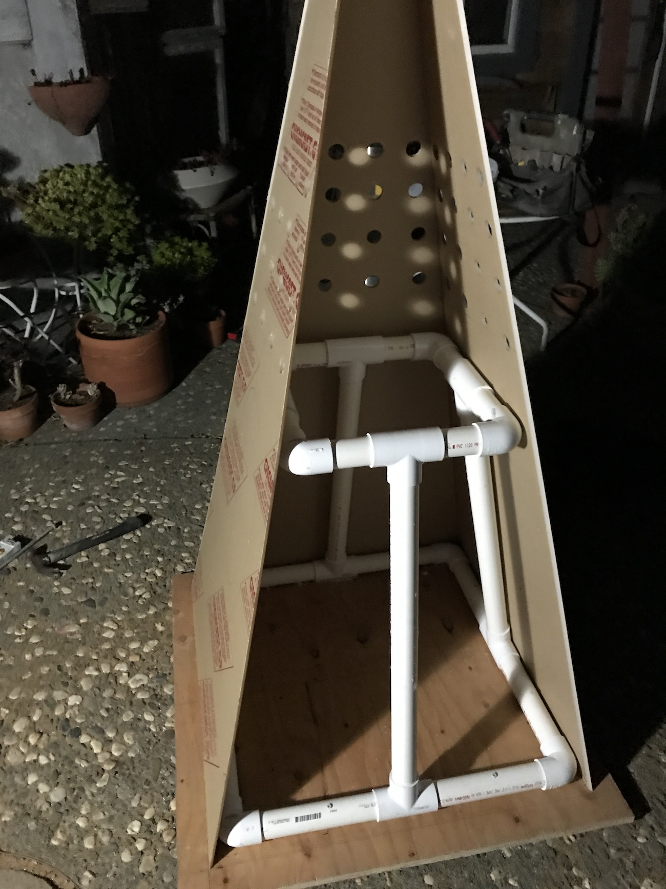</a><a href="assets/images/structure2.jpg" data-lightbox="structure" data-title="PVC Structure">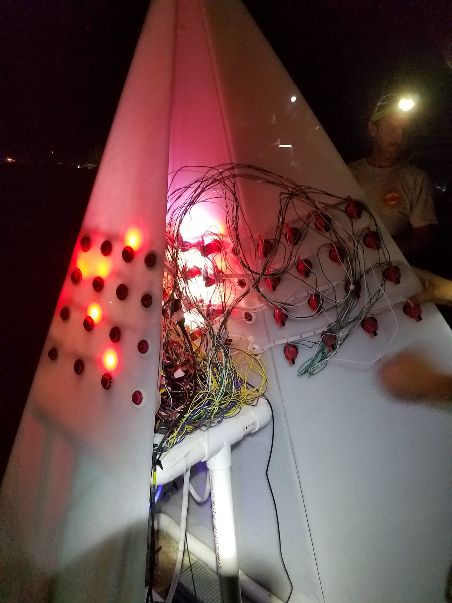</a>

Without Brian's help I would have assembled this thing with glue and tape and it probably would have collapsed on day one.

### Last minute freakout

While helping me with bevel angles, my woodworker friend [@jneaderhouser](https://twitter.com/jneaderhouser) also advised me to build a prototype. I forewent this step in favor of SketchUp, concerned I did not have time for additional construction. One week before the event that decision came back to bite me. I had purchased 64 [red arcade buttons](https://www.amazon.com/gp/product/B00V0OM7WO/ref=oh_aui_search_detailpage?ie=UTF8&psc=1) to be mounted in the pyramid sides, which would toggle the beats. As I assembled Beatboxer for the first time, I quickly realized that the buttons were so deep that they collided on the corners of the pyramid. I needed shallower buttons, but the holes in the pyramid had been cut specifically for the diameter of these larger buttons. Again a friend, [@oceanphoto](https://twitter.com/oceanphoto), swooped in to save the day. He quickly 3D printed mountings to allow smaller buttons to fit tightly in the pyramid holes:

<a href="assets/images/3d_button1.jpg" data-lightbox="3d_button" data-title="3D-printed button housing">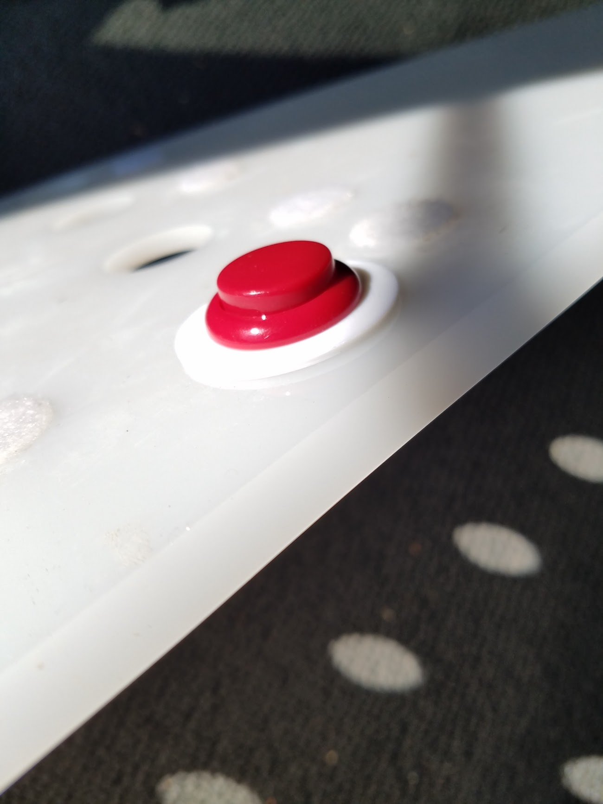</a><a href="assets/images/3d_button2.jpg" data-lightbox="3d_button" data-title="3D-printed button housing">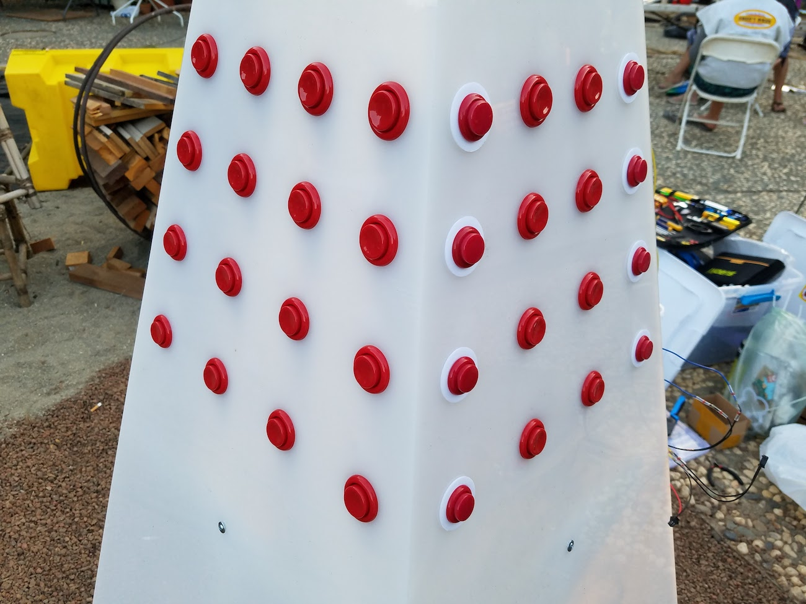</a>

## The big event

With all the pieces in place, my good friends Rob and [@cecbayan](https://www.instagram.com/cecbayan/) provided some space on their trailer next to their insane riding-lawnmower-turned-tank, [The Krawler](https://www.facebook.com/thekrawler/), to transport Beatboxer from the Bay Area to the Black Rock Desert.

Upon arrival setup went surprisingly smooth. The awesome folks at [The Artery](https://burningman.org/event/art-performance/artist-resources/) guided us to our placement location. The rest of the week was spent swapping and charging batteries and speakers, which proved a bit more challenging due to Beatboxer getting a lot more use than anticipated (an exciting problem to have). In the end it was fully functional roughly 90% of the week, with outages only due to batteries. The structure, buttons, and electronics held up to the elements.

2017 and 2018, respectively:

<a href="assets/images/beatboxer_playa.jpg" data-lightbox="beatboxer_playa" data-title="Beatboxer On Playa">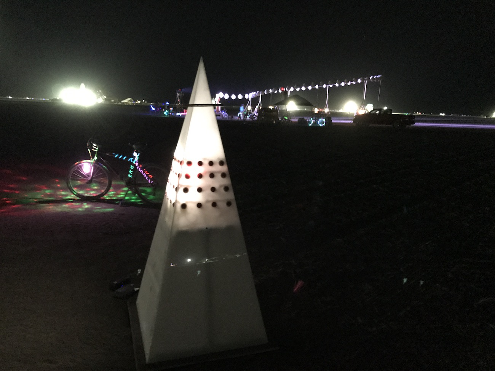</a><a href="assets/images/beatboxer_playa_2018.jpg" data-lightbox="beatboxer_playa" data-title="Beatboxer On Playa 2018">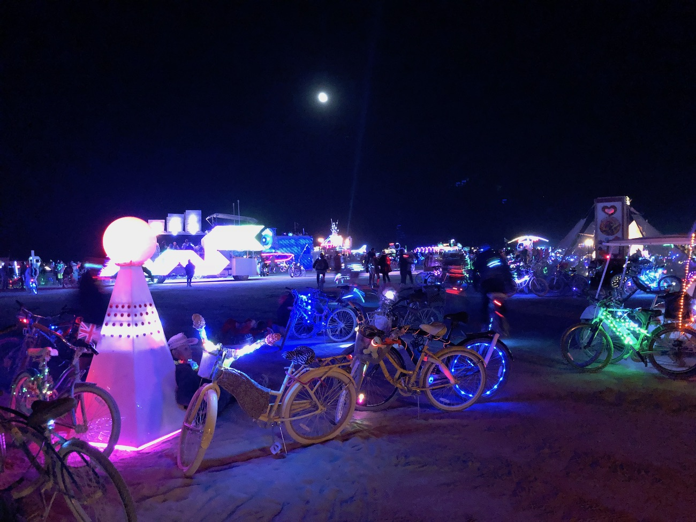</a>

## Lessons learned

I originally set out to build Beatboxer on my own, to see if I could, and also because I did not want to burden friends who already had amazing projects on their own plates. Though I quickly found that I was in way over my head, I fortunately also found folks who were extremely willing to get involved. Without everyone jumping in, there is no way this project would have happened. I cannot thank everyone enough.

<iframe width="560" height="315" src="https://www.youtube.com/embed/a7bc4D5Lgos" frameborder="0" allowfullscreen></iframe>

## Epilogue

As I learned to work with LEDs, I found opportunities to work with other artists to help light their own projects. While Beatboxer used about 300 LEDs, these projects demanded a bit more. Applying the same powering methods to these larger projects resulted in some melted electronics, necessitating a power redesign. Fortunately my friend [Tom](http://www.tinsel.org/) quickly provided a wiring diagram to overcome these power issues:

<a href="assets/images/fish_fritzing.png" data-lightbox="fish_fritzing" data-title="The Fish Fritzing">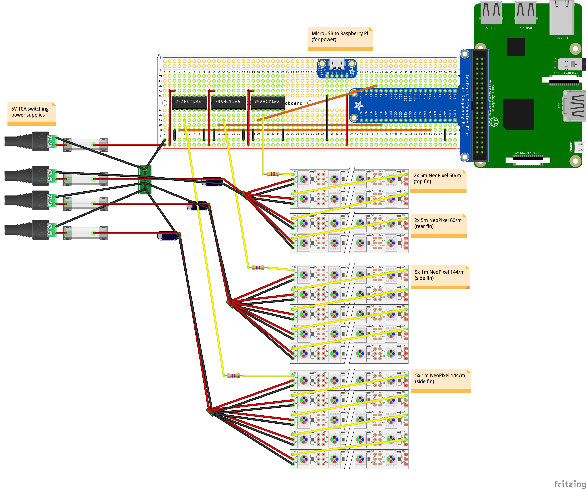</a>

To download the source Fritzing shareable sketch file, <a href="assets/images/fish_fritzing.fzz">click here</a> (requires the <a href="https://github.com/adafruit/Fritzing-Library">Adafruit Fritzing Library</a>). To view this project directly on the Fritzing site, head over to the
<a href="http://fritzing.org/projects/neopixels-on-mutant-vehicles">NeoPixels on Mutant Vehicles project</a> at <a href="http://fritzing.org">fritzing.org</a>.

With additional components and design complexity, my friend [@oceanphoto](https://twitter.com/oceanphoto) jumped back in and 3D printed some awesome enclosures to keep everything safe from the elements, and even included ethernet ports to be able to update the Pi without opening the enclosures:

<a href="assets/images/enclosure1.jpg" data-lightbox="enclosure" data-title="Enclosure">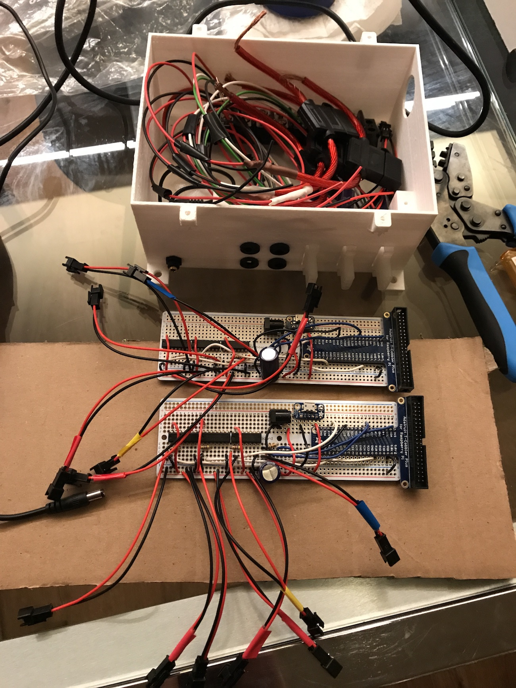</a><a href="assets/images/enclosure3.jpg" data-lightbox="enclosure" data-title="Enclosure">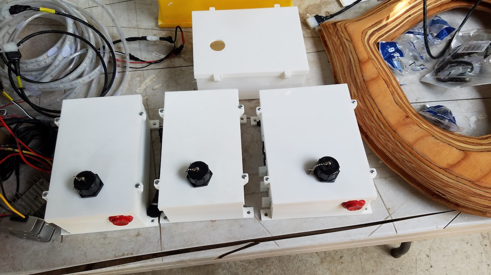</a>

Another requirement for these projects was faster boot time. With vanilla Raspian I was seeing 30 second boot times. This was fine for Beatboxer where it was left running all night, but too long for a mutant vehicle that should be illuminated as soon as possible when it's turned on. I switched to Raspbian Lite and disabled as many services as I could, eventually getting boot time down to around 7 seconds. For full details on these config changes, have a look at the [First Boot section of this repo's README.md](https://github.com/siggy/bbox#first-boot).

With power and boot time sorted, we were ready to apply these LEDs to three more projects.

<a href="assets/images/fish_beatboxer.jpg" data-lightbox="epilogue" data-title="Fish and Beatboxer">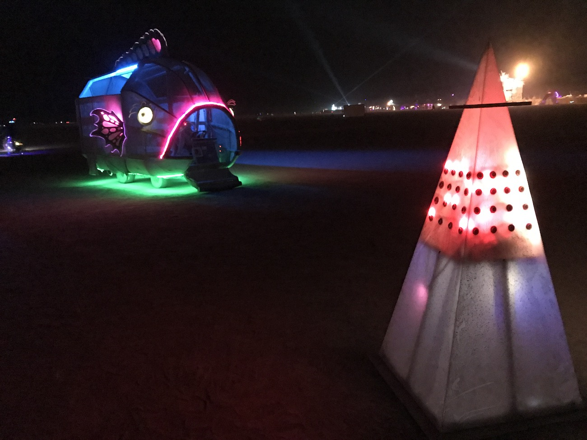</a>

### The Krawler

[The Krawler](https://www.facebook.com/thekrawler/) is Rob and [@cecbayan](https://www.instagram.com/cecbayan/)'s riding-lawnmower-turned-tank. It also shoots fire from eight poofers mounted on top. Here we added 480 LEDs along the bottom frame in a streak-like pattern, to highlight some of the amazing manufacturing and engineering that went into this vehicle.

<a href="assets/images/fish_krawler.jpg" data-lightbox="epilogue" data-title="Fish & Krawler">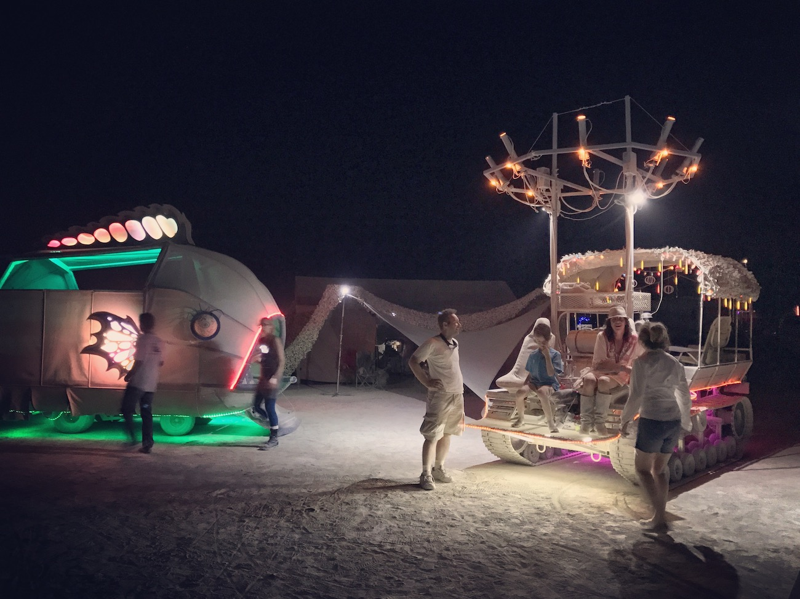</a>

### Crane of Remembrance

The Crane of Remembrance is a 15-foot tall replica of a Port of Oakland crane, and a tribute to the victims of the [Ghost Ship Fire](https://en.wikipedia.org/wiki/2016_Oakland_warehouse_fire). Our friend Rob is an Oakland firefighter, and was onsite during the incident. He inspired our group to build the Crane. The lighting included 540 LEDs, 240 in a beating heart, and 300 in two strands extending across the top. The heart beats at 36 BPM, and the strands display 36 lights at a time, one for each person lost in the fire.

<a href="assets/images/crane.jpg" data-lightbox="epilogue" data-title="Crane Of Remembrance">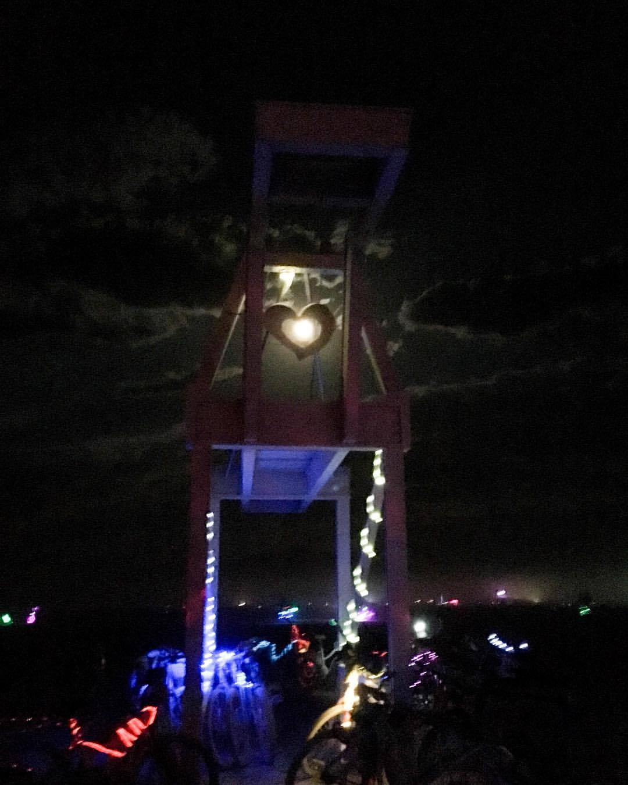</a>

### The Fish

The Fish is Brian's mutant vehicle, built on top of an airport luggage carrier. This year was the Fish's tenth year at Burning Man. This turned out to be the most ambitious lighting project, involving 2040 LEDs, all mounted in its four fins. Each side fin alone has 720 LEDs, and the top and back fins have a combined 600. Painting with LEDs on a canvas like this turned out to be quite a thrill:

<iframe width="560" height="315" src="https://www.youtube.com/embed/AYFAND0Bk_w" frameborder="0" allowfullscreen></iframe>

## Contact

Thanks for reading. If you have any questions or comments, you can <a href="https://github.com/siggy/bbox/issues">file an issue against this repo in Github</a>, or just hit me up on Twitter at <a href="https://twitter.com/siggy">@siggy</a>.

Published 2017.10.02. Updated 2019.05.17 with 2018 content.

## Beatboxer in real life

If you are interested in seeing Beatboxer in person, it will be on display Saturday, 2017.10.14 at <a href="https://burningman.org/events/san-francisco-decompression-2017/">SF Decompression</a>. Come say hi!

